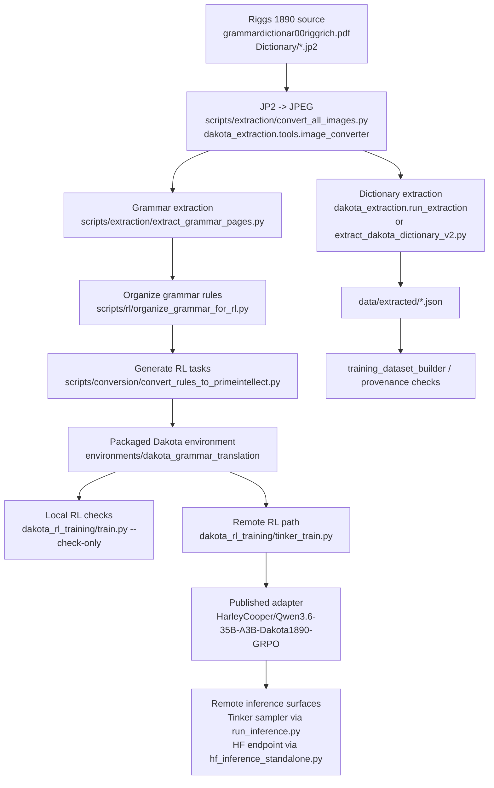
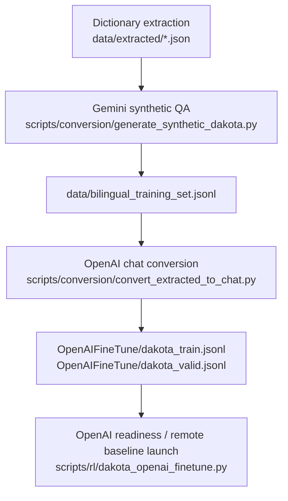

# Dakota1890 Pipeline

This is the canonical step-0 pipeline after the repository audit. It separates the primary Dakota RL chain from the secondary SFT comparison path.

## Primary Path

## Secondary Path

This path stays in the repo as a baseline and educational comparison, not the main story:

## Canonical Entry Points

- Extraction: `python -m dakota_extraction.run_extraction`
- Grammar extraction: `python scripts/extraction/extract_grammar_pages.py --pages 31-92 --yes`
- RL task generation: `python scripts/conversion/convert_rules_to_primeintellect.py`
- Packaged environment: `from dakota_grammar_translation import load_environment`
- Local RL check: `python dakota_rl_training/train.py --check-only`
- Remote RL path: `python dakota_rl_training/tinker_train.py ...`
- Tinker sampler inference: `python run_inference.py --prompt "..."`
- HF endpoint inference: `python hf_inference_standalone.py --endpoint-url "..." --prompt "..."`

## Current Artifact Counts

- Organized grammar rules: `1,497`
- RL tasks: `10,576`
- OpenAI baseline train split: `980`
- OpenAI baseline validation split: `245`

## Notes

- The packaged environment is the Dakota Grammar Gym. It wraps the RL task dataset plus the reward rubric and exposes `load_environment()`.
- The current published adapter metadata points to `Qwen/Qwen3.6-35B-A3B` with LoRA rank `32`.
- The local RL check path uses `Qwen/Qwen3-0.6B` for consumer-hardware validation.
