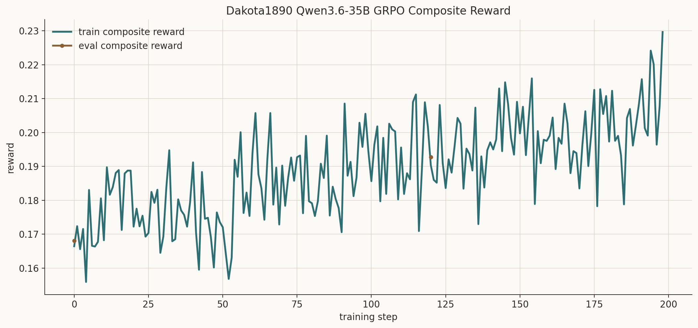
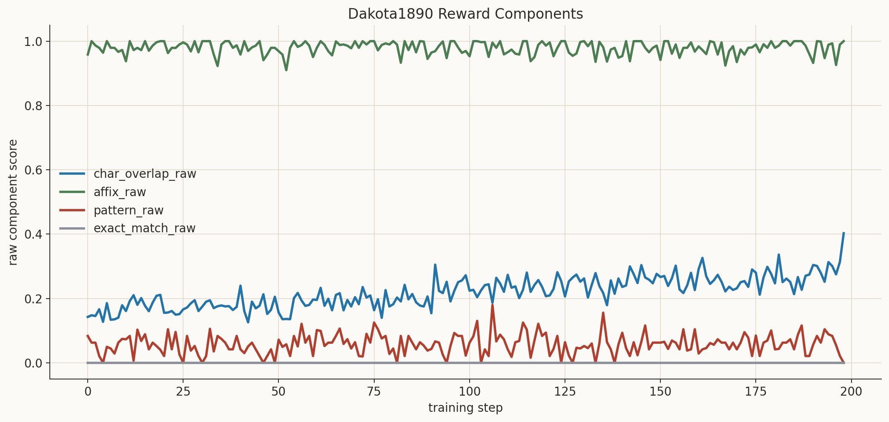
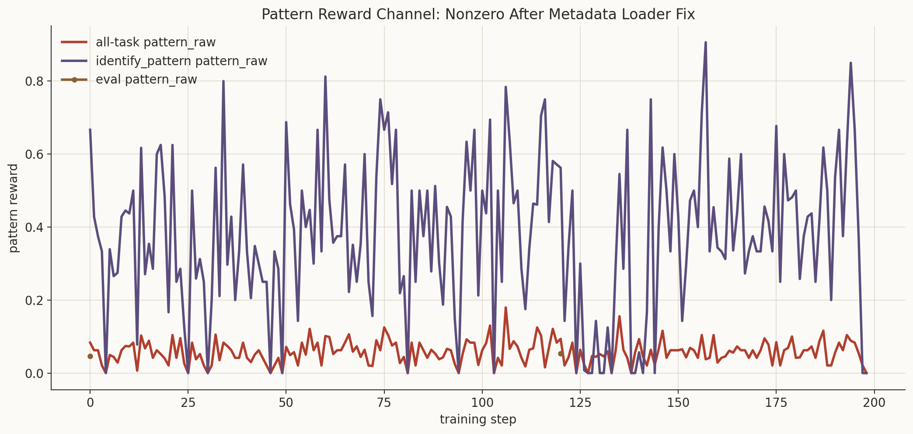

# Dakota1890

**A language model that read the 1890 Dakota grammar cover to cover — and is now ready for the community to teach it the rest.**


To our knowledge, this is the first time a model of this size has been trained from a **single historical source document** for an **endangered language**.

The model is not always right. That is not the point.

This is the working endpoint that modern descendants of Dakota speakers will correct — the way you correct a toddler learning to speak. The toddler has read the 1890 grammar cover to cover. It knows the orthography, the affixes, the morphology of the book. Now the community teaches it the rest. That community-in-the-loop second stage is the idea carried over from the companion **StoneyNakoda** project, where contemporary speakers correct and extend the model's output.

The whole pipeline runs from one public-domain book: Stephen Return Riggs' 1890 *Grammar and Dictionary of the Dakota Language*. Book → extraction → grammar rules → RL tasks → GRPO training → community correction.

---

## The model progression

Each model is published on Hugging Face. The arc runs from a 0.6B proof of concept to a 35B GRPO run.

| Model | Params | Method | Infra | Notes |
|---|---|---|---|---|
| [`Qwen3-0.6B-Dakota-Grammar-RL`](https://huggingface.co/HarleyCooper) | 0.6B | GRPO | PrimeIntellect | First proof: grammar rules as a reward signal |
| [`Qwen3-0.6B-Dakota-Grammar-RL-400`](https://huggingface.co/HarleyCooper) | 0.6B | GRPO | PrimeIntellect | 400-step run; 150% reward improvement |
| [`Qwen3-30B-Dakota1890`](https://huggingface.co/HarleyCooper) | 30B | GRPO | Tinker | First large-model scale-up |
| [`Qwen3-30B-ThinkingMachines-Dakota1890`](https://huggingface.co/HarleyCooper/Qwen3-30B-ThinkingMachines-Dakota1890) | 30B | GRPO | Tinker | 100% affix accuracy, 69.9% char preservation |
| [`Qwen3.6-35B-A3B-Dakota1890-GRPO`](https://huggingface.co/HarleyCooper/Qwen3.6-35B-A3B-Dakota1890-GRPO) | **35B** | **GRPO** | Tinker | **Latest** — published most recently |

The latest model, **Qwen3.6-35B-A3B-Dakota1890-GRPO**, is the current working endpoint — the toddler that has read the book. It is a live research checkpoint, not an authoritative Dakota assistant.

---

## The pipeline

One book becomes a self-contained training loop. No parallel corpus, no separate grammar documentation, no OCR training.

```
1890 Riggs grammar (PDF, public domain)
        │
        ▼
  VLM extraction          Claude reads the scans; preserves ŋ š ć ḣ exactly
        │
        ▼
  Grammar rules           1,497 rules across morphology, syntax, phonology,
        │                 conjugation, particles, translation
        ▼
  RL tasks                10,576 verifiable tasks (≈5.5 per rule):
        │                 morphology, translation, reverse translation,
        │                 syntax analysis, pattern ID
        ▼
  GRPO training           PrimeIntellect / Tinker; the reward IS the grammar
        │
        ▼
  Community correction     descendants of Dakota speakers correct the output —
                           the StoneyNakoda community-in-the-loop stage
```

The key move: grammar rules stop being static documentation and become **executable feedback**. Instead of asking a model to imitate text, the RL loop scores whether each output satisfies the orthographic, morphological, and task-level constraints pulled from the book.

---

## The reward function

The reward is **deterministic**. There is no LLM judge. Every component is independently verifiable, so the gradient is honest and you can see exactly what the model got wrong.

It decomposes a qualitative linguistic task into three measurable primitives:

```python
reward = (
    0.4 * character_preservation +   # orthography: ŋ š ć ḣ ṡ á é í ó ú preserved?
    0.4 * affix_accuracy +           # morphology: correct prefixes/suffixes applied?
    0.2 * semantic_correctness       # semantics: meaning preserved vs. ground truth?
) * difficulty_multiplier            # curriculum weight, 1.0x → 2.0x
```

- **Orthography** — recall of the required special Unicode characters against the source.
- **Morphology** — regex / pattern checks against specific extracted grammar rules (affix presence, possessives like `-ku`, `-ću`, `-tku`, plural `-pi`).
- **Semantics** — similarity to the ground-truth translation or dictionary lookup.

Because each piece is checkable by code rather than judgment, GRPO gets dense, multi-dimensional feedback on **structure**, not just imitation — which is why an RL approach works on a task usually considered too qualitative for it.

---

## See the proof

Everything above is the pitch. Below is what it actually looks like — the source book, the training curves, and the reward signal running live.

### The one book

It all starts with a single public-domain scan: Riggs' 1890 *Grammar and Dictionary of the Dakota Language*.


The grammar section (pages 31–92) and the dictionary section (pages 93–440) are the entire training corpus. No parallel text, no modern annotations.

| | |
|---|---|
| Dictionary entries → `{dakota:english}` pairs |  |
| Morphology and prepositions → extracted rules |  |


### The latest run — Qwen3.6-35B-A3B GRPO

The reward channels of the most recent 35B run, restored end to end: composite reward climbs, the pattern channel goes live after the schema fix, char-overlap rises while affix accuracy stays high, and the ledger audit confirms `composite_diff` stayed at zero.


| Composite reward progression | Reward components |
|---|---|
|  |  |



### The reward, running live

The deterministic reward is not a black box. Every component — character overlap, affix accuracy, semantic match, difficulty multiplier — is logged per step. Here is a single Tinker training step with the full ledger broken out:


### The method, end to end

How grammar rules become an executable reward function, file by file:


---

## Source material

Everything derives from one public-domain book:

> **Riggs, S. R. (1890).** *A Grammar and Dictionary of the Dakota Language.* Washington: Government Printing Office.

- ~665 page scans from the Internet Archive
- Grammar section (pages 31–92) → 1,497 rules
- Dictionary section (pages 93–440) → ~10,000 `{dakota:english}` pairs

Dakota is a Siouan language with a rich orthography — special consonants (`ć`, `š`, `ŋ`, `ḣ`), pitch accents (`á é í ó ú`), and agglutinative morphology. The special characters are what make the reward *verifiable*: they give an unambiguous signal of whether the model preserved the language's structure.

The code is Apache-2.0. The 1890 text is public domain (see `DATA_LICENSE.md`).

### Datasets

- [`HarleyCooper/adaption-dakota-english-qa`](https://huggingface.co/datasets/HarleyCooper/adaption-dakota-english-qa) — 1,950 bilingual Dakota–English QA pairs.
- **Stoney10kRL** — 10K entries from the companion Stoney Nakoda work, applying the same method to a related Siouan language.

---

## How to use

The latest adapter loads on top of its base model with PEFT:

```python
from transformers import AutoModelForCausalLM, AutoTokenizer
from peft import PeftModel

base = "Qwen/Qwen3.6-35B-A3B"
adapter = "HarleyCooper/Qwen3.6-35B-A3B-Dakota1890-GRPO"

model = AutoModelForCausalLM.from_pretrained(base, device_map="auto", trust_remote_code=True)
tok = AutoTokenizer.from_pretrained(base)
model = PeftModel.from_pretrained(model, adapter)

messages = [
    {"role": "system", "content": "You are a Dakota language expert."},
    {"role": "user", "content": "Translate 'my elder brother' to Dakota using the correct possessive suffix."},
]
text = tok.apply_chat_template(messages, tokenize=False, add_generation_prompt=True)
out = model.generate(**tok(text, return_tensors="pt").to(model.device), max_new_tokens=128)
print(tok.decode(out[0], skip_special_tokens=True))
```

Treat the output as a toddler's first attempt — a starting point for correction, not a final answer.

**Live demo:** the **StoneyApp** Space on Hugging Face Spaces shows the community-in-the-loop idea running on the related Stoney Nakoda model.

---

## Companion projects

- **StoneyNakoda** — the project this method came from. It runs the community-in-the-loop correction stage: contemporary Stoney Nakoda speakers correct and extend model output, turning a book-trained model into a living one. Dakota1890 reuses that pattern.
- **StoneyApp** — the live Hugging Face Space demo for the Stoney Nakoda model and its correction loop.

The larger claim is methodological: if a low-resource language has a usable historical source and a community willing to run the second stage, this pipeline can be reused rather than rebuilt.

---

## Links

- **Latest model:** https://huggingface.co/HarleyCooper/Qwen3.6-35B-A3B-Dakota1890-GRPO
- **Previous 30B model:** https://huggingface.co/HarleyCooper/Qwen3-30B-ThinkingMachines-Dakota1890
- **Dataset (Dakota QA):** https://huggingface.co/datasets/HarleyCooper/adaption-dakota-english-qa
- **W&B training logs:** https://wandb.ai/christian-cooper-us
- **All Hugging Face models:** https://huggingface.co/HarleyCooper
- **Source book (Internet Archive):** Riggs 1890, *A Grammar and Dictionary of the Dakota Language* (public domain)

---

## Acknowledgments

- **Stephen Return Riggs** — the 1890 grammar and dictionary.
- **Internet Archive** — the scanned source.
- **PrimeIntellect** and **Thinking Machines (Tinker)** — RL training infrastructure.
- **Anthropic** — VLM extraction.
- **The Dakota and Stoney Nakoda language communities** — who do the part that actually matters: teaching the model the rest.

## License

Code: **Apache-2.0** (`LICENSE`). Historical Dakota text (Riggs, 1890): **public domain** (`DATA_LICENSE.md`).
