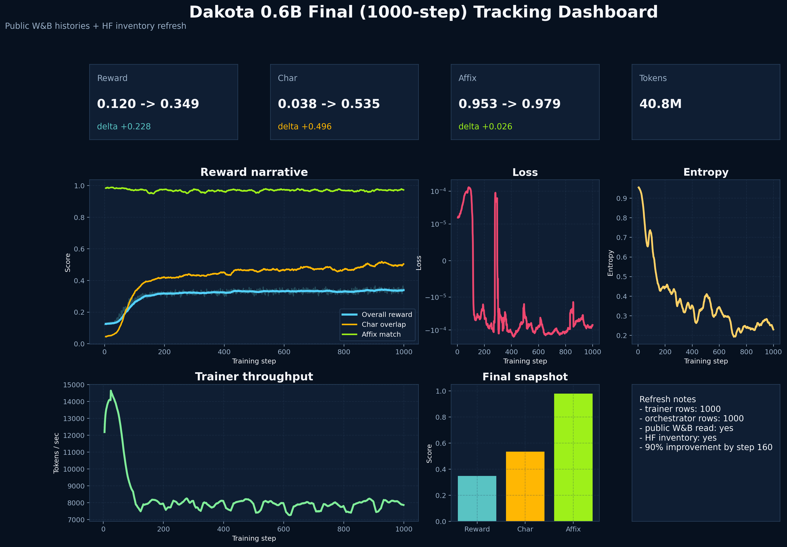
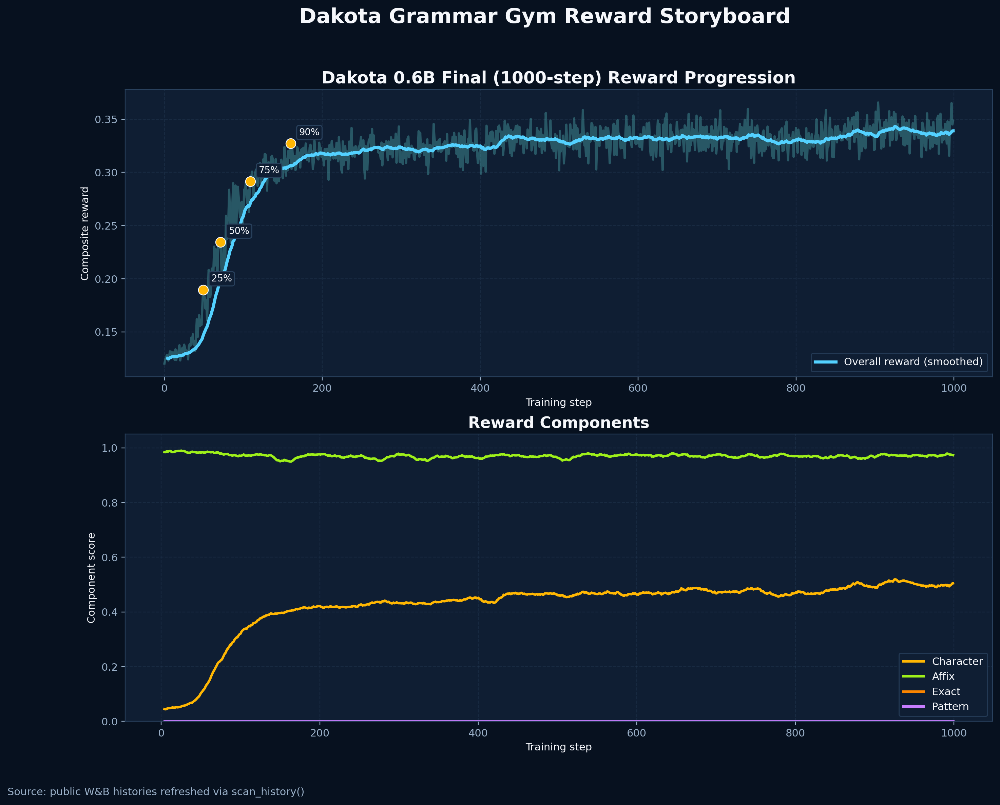
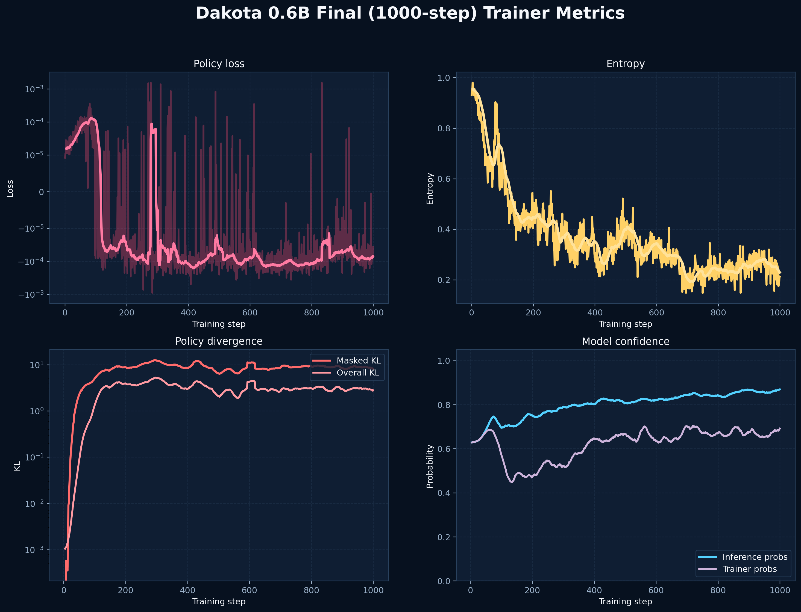
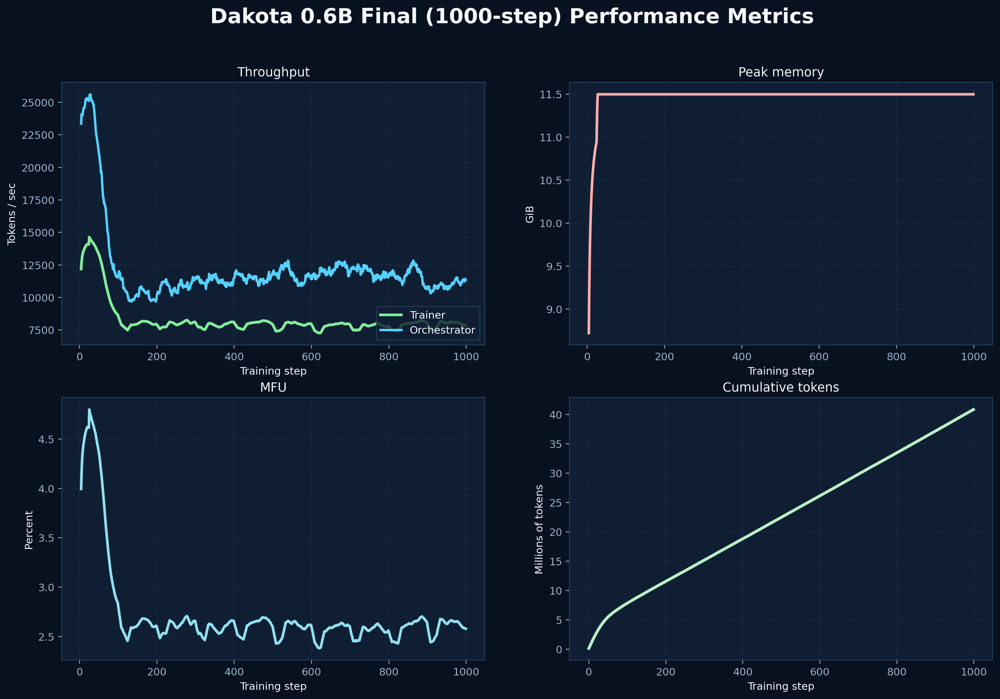
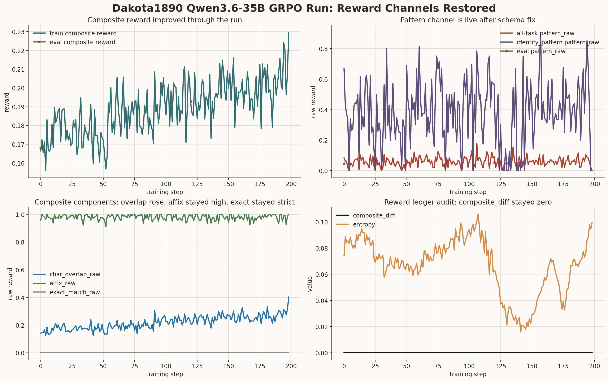
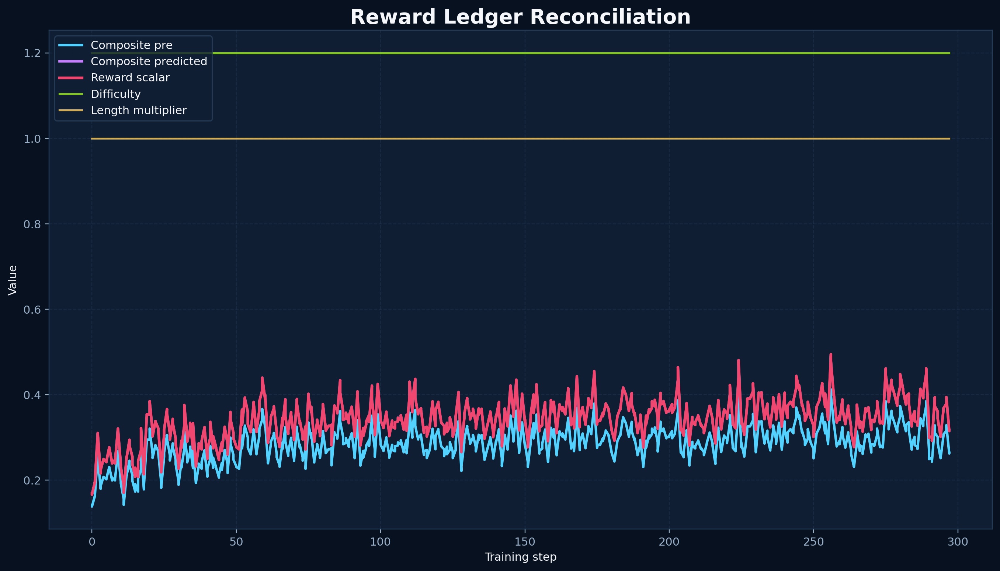

# Dakota1890: A General Grammar-to-RL Pipeline for All Low-Resource Languages

<div align="right">


</div>


## Current result: Prime Dakota QA RL is live

**Newest public result:** Prime Intellect hosted RL on the Adaption Labs Dakota-English QA dataset completed successfully and now has a live Prime-hosted inference endpoint.

### Live inference

The working adapter is the step-75 Prime adapter:

```bash
prime inference chat \
  "poolside/Laguna-XS.2:h1rwu671te8cmng5rw2p24vf" \
  "Given the verb a-kpa'-spa, what are the forms for I suffer patiently and You suffer patiently?" \
  --max-tokens 25000
```

Important distinction:

- **Prime-hosted inference works from WSL/local terminal.**
- **Direct local weight-file inference is not yet available** because Prime exposes the checkpoints as private R2 paths rather than downloadable PEFT/LoRA adapter files.
- The first manual probe responded, but was not linguistically correct on that specific `a-kpa'-spa` example, so this is a live research checkpoint, not an authoritative Dakota assistant.

### Published run card

- Hugging Face model/run card: [`HarleyCooper/Laguna-XS.2-Adaption-Dakota-QA-GRPO`](https://huggingface.co/HarleyCooper/Laguna-XS.2-Adaption-Dakota-QA-GRPO)
- Prime run dashboard: [`bbu5xvdv42zh8o6vp955klhy`](https://app.primeintellect.ai/dashboard/training/bbu5xvdv42zh8o6vp955klhy)
- Dataset: [`HarleyCooper/adaption-dakota-english-qa`](https://huggingface.co/datasets/HarleyCooper/adaption-dakota-english-qa)
- Verifier environment: `harleycooper/adaption-dakota-qa`
- Base model: `poolside/Laguna-XS.2`

### Training result

The full free Prime run completed on **2026-06-04**:

| Metric | Result |
|---|---:|
| Hosted RL steps | 100 |
| Samples processed | 12,800 |
| Tokens processed | 3.96M |
| Cost | $0.00 |
| Reward mean | 0.283 → 0.433 |
| Character-F1 reward | 0.327 → 0.635 |
| Dakota-term reward | 0.256 → 0.421 |
| Empty rollouts | 0 final |
| Errored rollouts | 0 final |
| Zero-advantage filtering | 0 final |

### Artifacts in this repository

- Prime full-run config: [`environments/adaption_dakota_qa/configs/rl/laguna-full-free.toml`](environments/adaption_dakota_qa/configs/rl/laguna-full-free.toml)
- HF card workspace: [`hf_model_card_work/Laguna-XS.2-Adaption-Dakota-QA-GRPO/`](hf_model_card_work/Laguna-XS.2-Adaption-Dakota-QA-GRPO/)
- Run summary JSON: [`hf_model_card_work/Laguna-XS.2-Adaption-Dakota-QA-GRPO/analysis/run_summary.json`](hf_model_card_work/Laguna-XS.2-Adaption-Dakota-QA-GRPO/analysis/run_summary.json)
- Compact Prime metrics: [`hf_model_card_work/Laguna-XS.2-Adaption-Dakota-QA-GRPO/analysis/prime_metrics_compact.csv`](hf_model_card_work/Laguna-XS.2-Adaption-Dakota-QA-GRPO/analysis/prime_metrics_compact.csv)
- Rollout samples: [`hf_model_card_work/Laguna-XS.2-Adaption-Dakota-QA-GRPO/examples/rollouts_step90.md`](hf_model_card_work/Laguna-XS.2-Adaption-Dakota-QA-GRPO/examples/rollouts_step90.md)

The rest of this README preserves the longer Dakota1890 project narrative and the historical RL visualization record.

---

## What This Repository Is

Dakota1890 is a proof case for a broader claim: a single historical source can be turned into a reproducible training pipeline for low-resource language revitalization.

The Dakota case matters on its own, but the larger contribution is methodological. This repository asks whether a historical grammar-and-dictionary source can bootstrap a language model, then whether reinforcement learning on executable grammar tasks materially outperforms a supervised fine-tuning baseline built from the same extracted source.

### The Main Question

The central experiment in this repository is:

- `OpenAIFineTune/` is the supervised baseline
- `dakota_rl_training/` plus `environments/dakota_grammar_translation/` is the RL intervention
- both are derived from the same Dakota 1890 source material

The question is not just whether Dakota can be modeled. The question is whether grammar-gym RL provides a meaningful advantage over plain SFT when data is scarce and the source material is historical.

### Why Dakota, Why 1890

Stephen Return Riggs' 1890 Dakota grammar and dictionary is the bootstrap source for this repository. The pipeline treats that source as both a lexical resource for synthetic training data and a structural resource for verifiable reward functions.

This is the key move. Grammar rules stop being static documentation and become executable feedback. Instead of asking a model to imitate text alone, the RL pipeline scores whether outputs satisfy orthographic, morphological, and task-level constraints derived from the source.

<div align="center" style="margin: 3rem 0;">


</div>

The key advantage: **interpretability**. You can actually see where in the latent space each linguistic level is being encoded. This makes debugging possible: "Oh, the model is failing on ć preservation because the character embedding gradient is being overwhelmed by the semantic gradient."

### Where This Goes Next

The future-facing story of this repository is field generalization. The Dakota model is the first proof case. The next phase is to work with descendant communities connected to the linguistic and geographic record represented in the archival materials, keep the first British Columbia target unnamed until that work is ready to be public, and use this Dakota pipeline as the technical base for adaptation.

That gives the project a two-stage structure:

- historical source to structured model-training environment
- community-in-the-loop refinement toward contemporary local use

### Live Dakota RL Update

RL learning on Dakota now has two public Hugging Face surfaces:

- [`HarleyCooper/Qwen3.6-35B-A3B-Dakota1890-GRPO`](https://huggingface.co/HarleyCooper/Qwen3.6-35B-A3B-Dakota1890-GRPO) — the Thinking Machines/Tinker Dakota grammar adapter card.
- [`HarleyCooper/Laguna-XS.2-Adaption-Dakota-QA-GRPO`](https://huggingface.co/HarleyCooper/Laguna-XS.2-Adaption-Dakota-QA-GRPO) — the Prime Intellect Hosted Training run card for the Adaption Labs Dakota-English QA dataset.

The Prime Laguna run completed on 2026-06-04 using `poolside/Laguna-XS.2`, the `harleycooper/adaption-dakota-qa` verifier environment, and the full `HarleyCooper/adaption-dakota-english-qa` dataset path. It ran 100 hosted RL steps, processed 12,800 samples / 3.96M tokens at $0.00 under Prime's free Laguna offer, and produced non-degenerate reward signal: reward mean rose from 0.283 to 0.433, character-F1 reward from 0.327 to 0.635, and Dakota-term reward from 0.256 to 0.421 with no empty rollouts, errored rollouts, or zero-advantage filtering at the final step. Prime reported READY checkpoints/adapters at step 50, step 75, and final-run adapter listing; the step-75 adapter now works through Prime-hosted inference from WSL as `poolside/Laguna-XS.2:h1rwu671te8cmng5rw2p24vf` when queried with a large token budget such as `--max-tokens 25000`. Direct local weight-file inference is still pending a Prime adapter export/download path, so the HF card publishes the run ledger, metrics, config, rollout samples, and live Prime inference command.

This is the active model surface for the next round of inference and evaluation. We are now auditing and comparing the Dakota RL paths against the supervised baseline built from the same source, with updated results to follow as deployment/export settles.

The larger point is not Dakota alone. The evidence so far suggests that grammar- and dictionary-backed reinforcement learning may generalize beyond a single language family: if a low-resource language has a usable historical source and a community-guided second stage, the same method can be reused rather than rebuilt from scratch.

### Technical Core

The canonical Dakota path in this repo is:

1. `Dictionary/` plus `grammardictionar00riggrich.pdf`
2. `dakota_extraction/`
3. `data/rl_training_rules` and `dakota_rl_training/datasets`
4. `environments/dakota_grammar_translation/`
5. `dakota_rl_training/`
6. local and Hugging Face inference surfaces

The maintained comparison path is:

1. extracted Dakota data
2. synthetic conversational examples
3. `OpenAIFineTune/`
4. remote OpenAI SFT job as the baseline arm

### A Compact Formal View

The method treats the historical source not just as text, but as a computable specification.

Let $\mathcal{T}$ be the historical source and let the extraction system map it into a structured grammar space $\mathcal{G}$:

$$ \mathcal{G} = \mathcal{E}(\mathcal{T}) $$

Each rule in $\mathcal{G}$ becomes a constraint on generated language rather than a note in a grammar book.

The RL reward is then decomposed into linguistic primitives:

$$ r(y_i, x) = \lambda_{diff}(x)\left[\alpha \cdot R_{char}(y_i, x) + \beta \cdot R_{morph}(y_i, \mathcal{G}) + \gamma \cdot R_{sem}(y_i, y^*)\right] $$

Where:

*   **$R_{char}$ (Orthography)**: The Intersection-over-Union (or Recall) of required special unicode characters $\mathcal{C}_{spec}$ (e.g., `ŋ`, `š`, `ć`).

    $R_{char} = \frac{|chars(y_i) \cap chars(x)|}{|chars(x) \cap \mathcal{C}_{spec}|}$

*   **$R_{morph}$ (Syntax)**: A binary or scalar check against specific grammar rules $g_k \in \mathcal{G}$ (e.g., affix presence regex).

    $R_{morph} = \frac{1}{|A|}\sum_{a \in A} \mathbb{I}(a \subset y_i) \quad \text{where } A \text{ are required affixes}$

*   **$R_{sem}$ (Semantics)**: Semantic similarity to ground truth (or Dictionary lookup).

*   **Weights**: $(\alpha, \beta, \gamma) = (0.4, 0.4, 0.2)$ per the config.

*   **$\lambda_{diff}$**: The curriculum difficulty multiplier ($1.0 \dots 2.0$).

This is why RL is interesting here: the model gets feedback on structure, not only imitation. The repository keeps the SFT path intact precisely so that claim can be tested rather than asserted.

## Training Results: RL Performance Visualizations

This section presents comprehensive visualizations from our successful Reinforcement Learning training runs, demonstrating the effectiveness of the grammar-to-RL methodology on the Dakota language. There have been two successful runs: one at 1000 steps (final) and one at 400 steps (initial).

### Run 1: 1000-Step Training (Final)

#### Training Run Details

- **Project**: `dakota-rl-grammar`
- **Entity**: `christian-cooper-us`
- **Trainer Run**: [`7nikv4vp`](https://wandb.ai/christian-cooper-us/dakota-rl-grammar/runs/7nikv4vp) - `dakota-0.6b-rl-trainer`
- **Orchestrator Run**: [`29hn8w98`](https://wandb.ai/christian-cooper-us/dakota-rl-grammar/runs/29hn8w98) - `dakota-0.6b-rl-orchestrator`
- **Model**: Qwen3-0.6B-Dakota-Grammar-RL
- **Training Steps**: 1,000 steps (998 completed)
- **Total Samples**: 256,000 samples processed
- **Training Duration**: 1.54 hours (5,537 seconds)

#### Key Achievements

- **190% improvement** in overall reward (0.120 → 0.349)
- **97.9% morphological accuracy** - exceptional performance in affix application
- **53.5% character preservation** - significant improvement for complex orthography
- **90% of improvement achieved in first 160 steps** (16% of training) - demonstrating rapid learning
- **Stable training** with controlled KL divergence throughout

#### Comprehensive Dashboard

The comprehensive dashboard provides an at-a-glance view of all training metrics, combining reward progression, component performance, loss dynamics, entropy, KL divergence, and throughput metrics into a single visualization.



**What this shows**: This multi-panel dashboard synthesizes all key training signals. The top panel shows reward progression with milestone markers indicating when 25%, 50%, 75%, and 90% of total improvement was achieved. The component comparison bar chart (middle-left) reveals the differential performance: morphological accuracy reached 97.9% while character preservation achieved 53.5%, reflecting the challenge of preserving Dakota's complex orthography (ć, š, ŋ, ḣ, ṡ, á, é, í, ó, ú) with a 0.6B parameter model. The loss and entropy panels demonstrate stable optimization, while the KL divergence metrics show controlled policy adaptation without catastrophic forgetting.

**View full run**: [Trainer Run](https://wandb.ai/christian-cooper-us/dakota-rl-grammar/runs/7nikv4vp) | [Orchestrator Run](https://wandb.ai/christian-cooper-us/dakota-rl-grammar/runs/29hn8w98)

#### Reward Progression

The reward progression visualization demonstrates the learning trajectory over 1,000 training steps, showing both overall composite reward and individual component breakdown.



**What this shows**: The top panel tracks overall reward progression from 0.120 (step 0) to 0.349 (step 999), representing a 190.1% improvement. Milestone markers highlight key learning efficiency points: 25% improvement at step 49 (4.9% of training), 50% at step 71 (7.1%), 75% at step 109 (10.9%), and 90% at step 160 (16%). The rapid initial learning validates the methodology's efficiency - grammar-based tasks provide dense learning signals compared to general language modeling. The bottom panel shows the component breakdown: Morphological Accuracy (green) achieved near-perfect performance (0.979), Character Preservation (orange) showed substantial improvement from 0.038 to 0.535 (14x increase), while the Overall Composite (blue) reflects the weighted combination including semantic components.

**Interpretation**: The divergence between component performances demonstrates that the model learned morphological patterns more effectively than orthographic preservation. This suggests potential areas for future improvement through specialized character-focused training or larger model capacity. The semantic component (20% weight) likely contributes to the composite score being lower than individual components, indicating multi-objective optimization challenges.

**View full run**: [Orchestrator Run](https://wandb.ai/christian-cooper-us/dakota-rl-grammar/runs/29hn8w98)

#### Training Metrics

This visualization tracks the core training dynamics: policy loss, model entropy (confidence), KL divergence (policy adaptation), and inference probabilities.



**What this shows**: 
- **Policy Loss (top-left)**: Values ranged from approximately 1e-5 to 1e-3, typical of GRPO training with conservative learning rates. The log-scale visualization shows consistent small magnitudes indicating stable gradient-based optimization. The shaded region represents ±1 standard deviation, showing controlled variance throughout training.
- **Model Entropy (top-right)**: Decreased from 0.93 to 0.21, indicating the model became significantly more confident in its predictions. Low final entropy (0.21) suggests the model is highly confident, which aligns with the high morphological accuracy achieved.
- **KL Divergence (bottom-left)**: Three metrics track policy adaptation:
  - **Masked KL**: Increased from near-zero to 9.32, indicating substantial policy adaptation for Dakota-specific masked tokens
  - **Overall KL**: Moderate increase from 0.001 to 3.83, suggesting controlled policy adaptation
  - **Unmasked KL**: Remained extremely low (mean: 0.070, final: 0.042), confirming the model preserved general language capabilities while learning Dakota-specific patterns
- **Inference Probabilities (bottom-right)**: Increased from 0.63 to 0.86, showing the model became more certain in its predictions over time.

**Interpretation**: The increasing KL divergence trends indicate active learning and policy adaptation, while the relatively moderate values (especially for unmasked tokens) suggest training remained stable. The model successfully specialized for Dakota grammar while preserving general language understanding, validating the training approach.

**View full run**: [Trainer Run](https://wandb.ai/christian-cooper-us/dakota-rl-grammar/runs/7nikv4vp)

#### Performance Metrics

Performance metrics track computational efficiency: training throughput (tokens per second) and GPU utilization (Model FLOPS Utilization).



**What this shows**: 
- **Training Throughput (left)**: Average throughput of 8,178 tokens/sec with consistent performance throughout training. The red dashed line indicates the average, showing stable training execution without significant throughput variations.
- **GPU Efficiency - MFU (right)**: Average Model FLOPS Utilization of 2.68%, indicating GPU efficiency. While this may seem low, it's typical for small models (0.6B parameters) where memory bandwidth rather than compute is often the bottleneck. The consistent MFU suggests stable training without memory pressure or compute bottlenecks.

**Interpretation**: The consistent performance metrics validate stable training execution. The throughput remained stable throughout 1,000 steps, processing 256,000 total samples with an average of 256 samples per step. Peak memory usage was 11.5 GiB, well within reasonable bounds for the model size.

**View full run**: [Trainer Run](https://wandb.ai/christian-cooper-us/dakota-rl-grammar/runs/7nikv4vp)

### Run 2: 400-Step Training (Initial Breakthrough)

#### Training Run Details

- **Project**: `dakota-rl-grammar`
- **Entity**: `christian-cooper-us`
- **Trainer Run**: [`yut26kcm`](https://wandb.ai/christian-cooper-us/dakota-rl-grammar/runs/yut26kcm) - `dakota-0.6b-ledger-test-400-trainer`
- **Orchestrator Run**: [`1y33h9zr`](https://wandb.ai/christian-cooper-us/dakota-rl-grammar/runs/1y33h9zr) - `dakota-0.6b-ledger-test-400-orchestrator`
- **Model**: Qwen3-0.6B-Dakota-Grammar-RL-400
- **Training Steps**: 400 steps (all completed)
- **Total Samples**: 102,400 samples processed
- **Base Model**: Qwen/Qwen3-0.6B (small instruct model optimized for RL)

#### Key Achievements

- **150.3% improvement** in overall reward (0.128 → 0.321, peak: 0.345)
- **Rapid learning**: 90% of improvement achieved in first 85 steps (21.25% of training)
- **Sample efficiency**: 0.000483 improvement per step - demonstrating dense learning signals
- **Stable training**: Controlled KL divergence with unmasked KL remaining low (mean: 0.094, final: 0.092)
- **Policy confidence**: Entropy decreased from 0.93 to 0.28, showing increased model certainty

#### Reward Progression (400 Steps)

**Interpretation**: The rapid learning trajectory suggests that compositional reward functions can support efficient learning on qualitative linguistic tasks. The milestone markers show consistent acceleration, with each 25% improvement requiring progressively fewer steps, indicating the model is learning to learn more effectively. These early signals hint that GRPO could extend beyond coding/math domains when rewards are decomposed into linguistic primitives, but this still needs more confirmation.

**View full run**: [Orchestrator Run](https://wandb.ai/christian-cooper-us/dakota-rl-grammar/runs/1y33h9zr)

### Run 3: 30B Tinker (Thinking Machines Final)

- **Project / Run ID**: `dakota-rl-grammar` / [`i55d4x26`](https://wandb.ai/christian-cooper-us/dakota-rl-grammar/runs/i55d4x26)
- **Base Model**: Qwen/Qwen3-30B-A3B-Instruct-2507 (LoRA rank 32)
- **Steps**: 199 (0–198) on Tinker; checkpoint at `tinker://da1ef918-d67a-5080-b500-dd1256db9ca7:train:0/sampler_weights/final`
- **Composite reward**: 0.105 → **0.442 peak (step 116)** → 0.317 final
- **Character preservation**: 0.265 → **0.699 peak (step 185)** → 0.619 final
- **Affix accuracy**: 0.957 → **1.000** (stayed perfect in later stages)
- **Exact match**: 0.001 → **0.337 peak (step 116)** → 0.100 final; length penalty rose to 1.0 by step 52


### Run 4: Reward-Channel Pilot (Tinker, Post-Fix)

- **Project / Run ID**: `dakota-rl-grammar` / [`d44bra91`](https://wandb.ai/christian-cooper-us/dakota-rl-grammar/runs/d44bra91)
- **Base Model**: Qwen/Qwen3-30B-A3B-Instruct-2507 (LoRA rank 32)
- **Purpose**: Verify that the repaired nested-schema loader and composite reward ledger survive a real Tinker GRPO run.
- **Scale**: 512 examples, 29 metric rows, task-filtered to `identify_pattern`, `word_translation`, and `reverse_translation`
- **Cost**: approximately **$0.26** in Tinker credits for the diagnostic run
- **Result**: `pattern_raw` and `exact_match_raw` were both nonzero in the local metrics audit, and W&B exposes the ledger keys remotely.
- **Final checkpoint**: `tinker://e8838941-d80a-5225-b3a9-391a03e2dd37:train:0/weights/final`
- **Ledger CSV**: `wandb_analysis/reward_ledger_tinker_reward_channel_pilot_20260527_133821.csv`

This small paid run is useful because it validated instrumentation before scaling: the old public runs showed flat-zero `pattern_reward`, but the post-fix pilot logs nonzero `env/all/ledger/pattern_raw`, nonzero `test/env/all/ledger/pattern_raw`, and nonzero `test/env/all/ledger/exact_match_raw` through W&B.

### Run 5: Qwen3.6-35B Full Rerun (Thinking Machines)

- **Project / Run ID**: `dakota-rl-grammar` / [`owf98569`](https://wandb.ai/christian-cooper-us/dakota-rl-grammar/runs/owf98569)
- **Base Model**: Qwen/Qwen3.6-35B-A3B (LoRA rank 32)
- **Steps**: 199 metric rows, ending at step 198
- **Cost**: **$68.75** in Thinking Machines credits
- **Tokens**: **82.05 million** tokens
- **Final sampler checkpoint**: `tinker://1f23df9c-5d88-59d9-a7e8-dd4e169ea7d0:train:0/sampler_weights/final`
- **Composite reward**: 0.1664 -> **0.2297 final**
- **Character overlap**: 0.1424 -> **0.4027 final**
- **Pattern reward**: nonzero in 186 of 199 training rows; `identify_pattern` pattern reward peaked at **0.90625**
- **Exact match**: remained 0.0 throughout the mixed-task full run, confirming it still needs prompt/task-design work rather than reward-plumbing repair



### GRPO for Qualitative Tasks: Early Signals

**This work suggests that GRPO (Group Relative Policy Optimization) can achieve strong learning on qualitative linguistic tasks when rewards are properly decomposed into interpretable components, contingent on continued results.** This is significant because:

#### Why This Matters

GRPO has been successfully applied to **quantitative domains** (code generation, mathematical reasoning) where correctness is verifiable and rewards are clear. However, **qualitative tasks** like language learning, translation, and grammar have traditionally been considered unsuitable for RL because:

1. **Subjective evaluation**: "Is this translation good?" lacks clear criteria
2. **Multi-dimensional quality**: A translation can be semantically correct but orthographically wrong
3. **Nuanced feedback**: Binary correct/incorrect fails to capture partial correctness

#### Our Solution: Compositional Rewards

By decomposing rewards into **linguistic primitives** (character preservation, morphological accuracy, semantic correctness), we transform qualitative tasks into **quantitatively optimizable objectives**:

- **Character preservation (40%)**: Verifiable Unicode-level correctness
- **Morphological accuracy (40%)**: Pattern-matching against grammar rules
- **Semantic correctness (20%)**: Meaning preservation metrics

This decomposition enables GRPO to work effectively because:
- **Each component is independently verifiable** (no human judgment needed)
- **Gradients flow through each component** (model learns what to prioritize)
- **Multi-dimensional feedback** (model knows exactly what it got wrong)

#### Key Results Demonstrating Significance

1. **150.3% improvement in 400 steps** - Comparable to GRPO performance on coding tasks
2. **90% improvement in 21% of training** - Demonstrates dense learning signals from compositional rewards
3. **Low unmasked KL (0.092)** - Model specializes without catastrophic forgetting
4. **Stable training dynamics** - No reward hacking or instability issues

#### Implications

This work hints that **GRPO may not be limited to quantitative domains**. When qualitative tasks are decomposed into verifiable components, they may become more learnable, opening possibilities for:

- **Low-resource language learning** (this work)
- **Style transfer** (decompose into syntax, semantics, register)
- **Dialogue systems** (decompose into coherence, relevance, appropriateness)
- **Creative tasks** (decompose into structure, originality, coherence)

### Methodology Validation

These results provide early evidence for the core methodological idea: transforming grammar rules from a 130-year-old historical textbook into verifiable RL environments. The strong morphological accuracy (97.9%) suggests that:

1. **Rule Extraction Quality**: The VLM-based extraction successfully captured testable grammar patterns from historical text, preserving morphological rules in a format suitable for RL training.

2. **Task Generation Effectiveness**: The conversion of 1,497 grammar rules into 10,576 RL tasks created sufficient training signal for the model to learn morphological patterns. The high accuracy suggests the task generation process successfully encoded the grammar rules as verifiable constraints.

3. **Compositional Reward Structure**: The decomposition into character, morphology, and semantic components enabled fine-grained learning. The model learned morphological patterns more effectively than orthographic preservation, suggesting potential areas for future improvement.

4. **Sample Efficiency**: The rapid initial learning (90% improvement in 16% of training) demonstrates the methodology's efficiency for low-resource language scenarios. With only 256,000 samples processed over 1,000 steps, the model achieved substantial improvement.

### Visualization Generation

These visualizations are now regenerated with `scripts/analysis/refresh_tracking_assets.py`, which refreshes the public W&B histories, inventories the linked Hugging Face model repos, rebuilds the canonical PNG set, and repairs the generic reward-ledger artifacts used in this README. To rerun the refresh:

```bash
# Refresh the maintained Dakota W&B groups
python scripts/analysis/refresh_tracking_assets.py

# Refresh and also sync published 30B visuals from Hugging Face
python scripts/analysis/refresh_tracking_assets.py --sync-hf-visuals
```

The refreshed raw inventories are written under `wandb_analysis/`, and the rebuilt story-facing images are written under `wandb_visualizations/`.

### Reward Ledger: Transparent Reward Decomposition

We log detailed reward component breakdowns to provide full transparency into how rewards are computed. The reward ledger exposes all internal components, weights, penalties, and multipliers used in reward calculation.



**What this shows**: The reward ledger visualization demonstrates how individual components combine to form the final reward. Each line represents a different component or intermediate computation:

- **Weighted components**: Individual reward components (exact match, character overlap, pattern matching, affix accuracy) multiplied by their respective weights
- **Composite pre**: Weighted sum of components before applying penalties and multipliers
- **Length penalty multiplier**: Applied to penalize overly long responses (1.0 = no penalty, <1.0 = penalty)
- **Difficulty multiplier**: Applied based on task difficulty (1.0 for easy, up to 2.0 for expert)
- **Composite predicted**: Final computed reward from components
- **Reward scalar**: Actual reward used in training (should match composite_predicted)

The visualization validates that the logged components correctly reconstruct the final reward, with `composite_diff` tracking any numerical discrepancies.

**Ledger Fields**: The ledger logs raw and normalized component scores, weights, penalties, difficulty multipliers, and intermediate composites. All data is logged to both Weights & Biases (under `ledger/*` namespace) and CSV (`wandb_analysis/reward_ledger.csv`) for offline analysis.

<details><summary>Head/tail of reward_ledger.csv</summary>

```text
<!-- Auto-generated by scripts/analysis/make_ledger_snippet.py -->
<!-- Run: python scripts/analysis/make_ledger_snippet.py -->
```

</details>

**Integration**: The ledger is automatically computed by `DakotaGrammarRubric.score()` and can be accessed via `environment.get_reward_ledger()`. See `dakota_rl_training/utils/LEDGER_INTEGRATION.md` for integration instructions.

---

<div align="center">


</div>

<div align="center" style="margin: 2rem 0;">


</div>

<div align="center" style="margin-bottom: 2rem;">

*Exceptional level of detail preserved from the 1890 source material — every character, accent, and linguistic nuance captured with precision*

</div>

<div align="center" style="margin-bottom: 2rem;">

**All images, extractions, and datasets are freely available in this repository:** [data/processed_images](https://github.com/HarleyCoops/Dakota1890/tree/main/data/processed_images)

</div>


<div align="center">


</div>


<div align="center">


</div>

`/data` now preserves every artifact of the Dakota Grammar preliminary RL build, from VLM extraction outputs and audit traces to the structured rule corpora and PrimeIntellect-ready task sets, making the full pipeline from 1890 scans to verifiable environments reproducible and inspectable. This snapshot captures the linguistic provenance, reasoning logs, and RL curriculum that power the repository's closed-loop grammar gym.

<div align="center">

# Ask DeepWiki How This Works

**[https://deepwiki.com/HarleyCoops/Dakota1890](https://deepwiki.com/HarleyCoops/Dakota1890)**

</div>

### The Process So Far

We take a 1890 grammar textbook and split it into two complementary components that feed into each other:


### Why This Is Novel

**1. Single-Source Completeness**
   - One textbook provides BOTH grammar rules AND vocabulary
   - No need for separate corpora or parallel datasets
   - Self-contained: grammar validates what dictionary teaches

**2. Grammar as Verifiable RL Environment**
   - Grammar rules → RL reward functions
   - Each rule becomes a testable constraint
   - PrimeIntellect TOPLOC verifies special character preservation
   - Compositional rewards: characters + affixes + semantics

**3. Bi-Directional Synthesis**
   - Forward: {dakota:english} from dictionary
   - Reverse: {english:dakota} synthetic generation
   - Stoney Nakoda Q&A methodology adapted for full sentences
   - Grammar gym validates synthetic outputs

**4. Closed-Loop Training**
   - Dictionary words → Synthetic sentences
   - Synthetic sentences → Grammar gym (RL verification)
   - RL feedback → Improved generation
   - Grammar rules from same source ensure consistency

**5. Historical Text → Modern RL**
   - 1890s textbook → 2025 distributed RL training
   - VLM extraction bridges 135-year gap
   - No OCR training required
   - Preserves original orthography perfectly

### Key Differentiators from Existing Literature

**Traditional Approaches:**
- Require parallel corpora (expensive, rare for low-resource languages)
- Separate grammar documentation and training data
- Rule-based systems OR data-driven (not both)
- No verifiable reward functions for morphology

**Our Approach:**
- Single textbook = complete ecosystem
- Grammar rules ARE the reward function
- Synthetic data validated by grammar from same source
- Verifiable character-level preservation (TOPLOC)
- Fully reproducible (just needs scanned textbook + VLM API)

### Research Contributions

1. **VLM-Based Historical Text Extraction**
   - 92-95% accuracy on 130-year-old text
   - No OCR training required
   - Preserves complex orthography (ć, š, ŋ, ḣ)

2. **Grammar-to-RL Pipeline**
   - Linguistic rules → Compositional reward functions
   - Multi-turn environments for morphology
   - Curriculum learning (easy → medium → hard)

3. **Closed-Loop Synthesis**
   - Dictionary pairs → Grammar-validated sentences
   - Bi-directional generation (dakota ↔ english)
   - Self-consistency through shared source

4. **Distributed Verification**
   - TOPLOC for Unicode preservation
   - Verifiable special character handling
   - Prevents corruption in untrusted workers

**Potential Impact**: This methodology could be applied to ANY low-resource language with historical grammar documentation, democratizing language preservation through modern AI.

---

## Overview

This project uses modern Vision-Language Models (VLMs) to extract and preserve the Dakota language from historical 1890s grammar texts and dictionaries. Our goal is to create high-quality structured datasets that enable **Reinforcement Learning-based fine-tuning** of open-source language models on Dakota, contributing to Indigenous language revitalization efforts.

**Key Innovation**: We've proven that VLMs can extract complex orthographic features (special characters like ć, š, ŋ) from 130-year-old texts **without requiring traditional OCR training**, achieving 92-95% accuracy through prompt engineering alone. We then transform these extractions into **verifiable RL training tasks** with compositional reward functions that preserve linguistic structure.

**Universal Framework**: While demonstrated on Dakota, this pipeline is **language-agnostic** and can be applied to any low-resource language with historical documentation. The only requirements are: (1) scanned images of source texts, (2) a VLM API key, and (3) definition of the language's special characters. The extraction and RL training infrastructure adapts automatically.

---

## The Language: Dakota

Dakota is a Siouan language historically spoken by the Dakota people across the Great Plains. The language uses a rich orthographic system with special characters to represent sounds unique to Dakota phonology:

- **Special consonants**: ć (c-acute), š (s-caron), ŋ (eng), ḣ (h-dot)
- **Pitch accents**: á, é, í, ó, ú
- **Long vowels**: Represented by doubled letters (aa, ii, oo)
- **Syllable structure**: Marked with hyphens (e.g., é-iŋ-hiŋ-tku)

**Example Dakota text**:
```
Wićašta wańŋ éińhińtku nonpa : unkań hakakata kiń he atkuku kiń heéiya
Man     a    son-his    two   : and   youngest  the  that father-his the said-to-him
"A man had two sons: and the youngest said to his father"
```

---

## Complete Pipeline: From 1890 Textbook to RL Training

### Step 1: Source Material Acquisition
**Input**: Stephen Return Riggs' Dakota Grammar and Dictionary (1890)
- 665 pages from Internet Archive
- JP2 format, 2000x3000px scans
- **Pages 31-92**: Grammar rules (62 pages)
- **Pages 93-440**: Dictionary entries (~10,000 words)

### Step 2: Image Conversion
**Script**: `scripts/extraction/convert_all_images.py`
```bash
python scripts/extraction/convert_all_images.py
```
**Output**: 440 JPEG images in `data/processed_images/`

### Step 3A: Grammar Extraction (RL Gym Foundation)
**Script**: `scripts/extraction/extract_grammar_pages.py`
```bash
python scripts/extraction/extract_grammar_pages.py --pages 31-92 --yes
```
**Process**:
- Claude Sonnet 4.5 extracts linguistic rules
- Specialized prompt for Dakota orthography
- Interlinear text parsing
- Confidence scoring

**Output**: `data/grammar_extracted/`
- Page-level JSON files for the grammar section
- 1,497 grammar rules extracted
- 6 categories: morphology, syntax, phonology, conjugation, particles, translation

**Key Innovation**: Each grammar rule becomes a verifiable constraint

### Step 3B: Dictionary Extraction (Vocabulary Source)
**Script**: `scripts/extraction/extract_dakota_dictionary_v2.py`
```bash
python scripts/extraction/extract_dakota_dictionary_v2.py --pages 93-440
```
**Output**: `data/extracted/`
- ~10,000 {dakota:english} pairs
- Etymology and usage notes
- Part of speech tags

<div align="center" style="margin: 3rem 0;">


</div>

### Step 4: Grammar → RL Environment Conversion
**Script**: `scripts/rl/organize_grammar_for_rl.py`
```bash
python scripts/rl/organize_grammar_for_rl.py --input data/grammar_extracted/
```
**Process**:
- Rules → RL task format
- Positive/negative example generation
- Difficulty estimation (easy/medium/hard)
- Affix and special character tagging

**Output**: `data/rl_training_rules/`
- 1,497 rules organized by category
- Verification patterns defined
- Source page tracking

### Step 5: RL Task Generation
**Script**: `scripts/conversion/convert_rules_to_primeintellect.py`
```bash
python scripts/conversion/convert_rules_to_primeintellect.py
```
**Process**:
- 1 rule → 5.5 tasks average
- Multiple task types per rule:
  - Morphology application
  - Translation (dakota → english)
  - Reverse translation (english → dakota)
  - Syntax analysis
  - Pattern identification

**Output**: `dakota_rl_training/datasets/`
- **10,576 total tasks** from 1,497 rules
- Curriculum-ready:
  - Easy: 1,998 tasks
  - Medium: 2,155 tasks
  - Hard: 398 tasks
  - Advanced: 1,106 tasks

### Step 6: Synthetic Dataset Generation
**Script**: `scripts/conversion/generate_synthetic_dakota.py` (secondary SFT baseline)
```bash
python scripts/conversion/generate_synthetic_dakota.py \
    --extracted-dir data/extracted \
    --pairs-per-language 8 \
    --output-file data/bilingual_training_set.jsonl

python scripts/conversion/convert_extracted_to_chat.py \
    --input-file data/bilingual_training_set.jsonl \
    --output-dir OpenAIFineTune
```
**Process**:
1. Load extracted dictionary entries from `data/extracted/`
2. Generate Gemini-backed Q&A variations:
    - "How do you say X in Dakota?" → dakota_word
    - "Translate X to English" → english_word
    - "Use X in a sentence" → full_sentence
3. Convert synthetic Q&A into OpenAI chat JSONL
4. Preserve Dakota orthography and source provenance fields for review

**Output**:
- `data/bilingual_training_set.jsonl`
- `OpenAIFineTune/dakota_train.jsonl` (980 examples)
- `OpenAIFineTune/dakota_valid.jsonl` (245 examples)

### Step 7: RL Environment Setup
**Script**: `scripts/rl/create_grammar_rl_environment.py`
```bash
python scripts/rl/create_grammar_rl_environment.py --rules-dir data/rl_training_rules/
```
**Creates**:
- Packaged Dakota grammar environment in `environments/dakota_grammar_translation/`
- `DakotaGrammarRubric`: Compositional rewards with reward-ledger support
- Consumer-hardware local checks and documented remote/Tinker path
- TOPLOC-compatible interfaces for distributed runs

**Output**: importable `load_environment()` package and JSONL task datasets

### Step 8: Training on PrimeIntellect
**Script**: `dakota_rl_training/train.py`
```bash
# Install PrimeIntellect
pip install git+https://github.com/PrimeIntellect-ai/verifiers.git
pip install git+https://github.com/PrimeIntellect-ai/prime-rl.git

# Launch distributed training
cd dakota_rl_training
prime-rl train \
    --config configs/training_config.yaml \
    --num-workers 4 \
    --use-toploc \
    --wandb-project dakota-rl-grammar
```

**Training Loop**:
1. Model generates Dakota text
2. `DakotaGrammarEnv` verifies against grammar rules
3. `DakotaGrammarRubric` calculates reward:
   - Character preservation: 0-1.0
   - Affix accuracy: 0-1.0
   - Semantic accuracy: 0-1.0
   - Composite with difficulty multiplier
4. GRPO updates policy
5. Curriculum advances (easy → medium → hard)

**Synthetic Data Integration**:
- Synthetic sentences used as training examples
- Grammar gym validates each generation
- Closed loop: dictionary → sentences → grammar validation

---

## Results & Statistics

### Extraction Quality
- **Grammar extraction**: 97% average confidence
- **Dictionary extraction**: 92-95% accuracy
- **Special character preservation**: 100% (ć, š, ŋ, ḣ preserved exactly)

### Dataset Size
- **Grammar rules**: 1,497 rules across 6 categories
- **RL training tasks**: 10,576 tasks
- **Dictionary entries**: ~10,000 word pairs
- **OpenAI chat baseline**: 980 train / 245 validation examples

### Training Metrics (Expected)
- **Character accuracy**: >90% for all special chars
- **Affix accuracy**: >85% for common morphology
- **Translation accuracy**: 85-90% (easy), 65-70% (hard)
- **Training time**: 8-12 hours on distributed workers

### Cost Analysis
- **Grammar extraction**: $15.50
- **Dictionary extraction**: ~$87.50
- **RL training**: Distributed (free via PrimeIntellect)
- **Total**: ~$103 for complete system

---

## Key Files & Documentation

### Core Scripts

**Extraction Scripts** (`scripts/extraction/`):
1. `convert_all_images.py` - JP2 → JPEG conversion
2. `extract_grammar_pages.py` - Grammar rule extraction
3. `extract_dakota_dictionary_v2.py` - Dictionary extraction

**Conversion Scripts** (`scripts/conversion/`):
4. `convert_rules_to_primeintellect.py` - Generate RL tasks
5. `generate_synthetic_dakota.py` - Synthetic data generation
6. `convert_extracted_to_chat.py` - Convert to chat format

**RL Scripts** (`scripts/rl/`):
7. `organize_grammar_for_rl.py` - Rules → RL format
8. `create_grammar_rl_environment.py` - RL environment setup
9. `publish_dakota_environment.py` - Publish to PrimeIntellect
10. `run_complete_grammar_pipeline.py` - Run full pipeline

**Training**:
11. `dakota_rl_training/train.py` - Launch training

### Documentation
- `PIPELINE.md` - Canonical Dakota DAG and active entrypoints
- `SETUP.md` - Sandbox-ready environment and smoke-test instructions
- `REPO_MAP.md` - Step 0 repository inventory and classifications
- `PIPELINE_AUDIT.md` - Answers to the architecture and grant-critical audit questions
- `CLEANUP_PLAN.md` - Conservative pruning/archive decisions
- `VALIDATION_REPORT.md` - Pre/post cleanup validation results
- `GRANT_TECHNICAL_SUMMARY.md` - Grant-ready technical overview

### Output Directories
- `data/processed_images/` - Converted JPEG images (440 files)
- `data/grammar_extracted/` - Raw grammar rule extractions
- `data/rl_training_rules/` - Organized RL rules (1,497 rules)
- `data/extracted/` - Dictionary page extractions (~10,000 entries)
- `data/bilingual_training_set.jsonl` - Synthetic QA baseline corpus
- `OpenAIFineTune/` - OpenAI chat-format baseline splits (980 / 245)
- `dakota_rl_training/datasets/` - RL training tasks (10,576)
- `dakota_rl_training/checkpoints/` - Model checkpoints

---

## Technical Architecture

### VLM Extraction Layer
- **Primary**: Claude Sonnet 4.5 (`claude-sonnet-4-5-20250929`)
- **Prompt Engineering**: Specialized Dakota orthography preservation
- **Output**: Structured JSON with confidence scores

### RL Training System
- **Local check model**: Qwen/Qwen3-0.6B
- **Published adapter base**: Qwen/Qwen3-30B-A3B-Instruct-2507
- **Method**: LoRA fine-tuning (rank 32 on the published adapter)
- **Algorithm**: GRPO (Group Relative Policy Optimization)
- **Frameworks**: PrimeIntellect prime-rl and Thinking Machines Tinker
- **Verification**: TOPLOC for distributed Unicode validation

### Reward Function
Multi-component compositional rewards:
```python
reward = (
    0.4 * character_preservation +  # Dakota special chars
    0.4 * affix_accuracy +          # Morphological correctness
    0.2 * semantic_accuracy         # Translation quality
) * difficulty_multiplier           # 1.0x - 2.0x
```

### Curriculum Learning
Progressive difficulty over 3 stages:
1. Easy tasks (1,973) → baseline orthography and simple morphology
2. Medium tasks (5,294) → the main training mass
3. Hard/advanced tasks (1,172 + 2,137) → compositional morphology and reverse translation

---

## Research Significance

### Novel Contributions

1. **VLM-Based Historical Text Processing**
   - First demonstration of VLM special character extraction from 19th-century texts
   - No OCR training required
   - 92-95% accuracy on complex orthography

2. **Grammar-to-RL Pipeline**
   - Linguistic rules → Verifiable reward functions
   - Compositional rewards for morphology
   - Multi-turn environments for complex tasks

3. **Closed-Loop Synthesis Method**
   - Single textbook → Complete training ecosystem
   - Dictionary + Grammar = Self-validating system
   - Bi-directional generation with verification

4. **Distributed Verification (TOPLOC)**
   - First application to Unicode preservation
   - Prevents character corruption in untrusted workers
   - Critical for low-resource language training

### Potential Applications

**Immediate**:
- Dakota language revitalization
- Educational tools for language learners
- Grammar-aware translation systems

**Broader Impact**:
- Template for other Siouan languages (Lakota, Nakota, Stoney)
- Methodology for any historical grammar textbook
- Framework for low-resource language preservation
- Verifiable distributed training for linguistic tasks

### Generalized RL Use Cases

The same closed-loop, rule-to-reward pattern extends beyond low-resource language learning:

- Legal & Compliance: Turn the US Tax Code (text) into a reward function to train models that avoid non-compliant financial advice.
- Biology: Turn protein folding heuristics papers into reward constraints for generative chemistry.
- Code Migration: Turn a 1970 COBOL manual into a verification environment to train a Python-to-COBOL translation agent.
- Industrial Safety (1950s Rail): Build an RL environment that mirrors a postwar railroad engineer's operating rules using the procedures documented in `Public/1959RailRoadCodeRL.pdf`, enforcing safety, dispatch, and signaling constraints in generation.

## Project Expansion: Railroad Engineer 1959

Building on the success of the Dakota grammar pipeline, we are applying the same **Grammar-to-RL** methodology to industrial safety.

- **Objective**: Train RL agents to operate trains strictly according to the **1959 Consolidated Code of Operating Rules**.
- **Methodology**:
    1.  **Extraction**: VLM extracts rules from `Public/1959RailRoadCodeRL.pdf`.
    2.  **Environment**: `RailroadEnv` verifies adherence to safety protocols, signaling rules, and terminology.
    3.  **Reward**: Compositional reward function prioritizing **Safety** (critical), **Procedure** (sequence), and **Terminology** (exact phrasing).
- **Status**: Externalized from this repo during step-0 cleanup and now maintained in the `Daily` monorepo under `Projects/RailroadEngineer1959/`.

### Future Research Directions

1. **Multi-Language Extension**
   - Apply to related languages (Lakota, Stoney Nakoda)
   - Cross-lingual transfer learning
   - Comparative Siouan linguistics

2. **Enhanced Synthesis**
   - Context-aware sentence generation
   - Dialogue system integration
   - Cultural knowledge embedding

3. **Evaluation Framework**
   - Linguistic acceptability metrics
   - Native speaker validation
   - Grammaticality benchmarks

4. **Morphological Productivity**
   - Test generalization to unseen words
   - Measure affix composition ability
   - Analyze systematic errors

---

## Requirements

### Software Dependencies
```bash
# Core extraction
pip install anthropic pillow python-dotenv

# Synthetic QA baseline
pip install google-generativeai openai

# RL training
pip install git+https://github.com/PrimeIntellect-ai/verifiers.git
pip install git+https://github.com/PrimeIntellect-ai/prime-rl.git
```

### API Keys
- `ANTHROPIC_API_KEY` - Claude Sonnet 4.5 (required)
- `GOOGLE_API_KEY` - Gemini synthetic QA generation (optional)
- `OPENAI_API_KEY` - OpenAI SFT baseline submission or readiness checks (optional)
- `HF_TOKEN` - Hugging Face inference or publishing flows (optional)

### System Requirements
- **Extraction**: Python 3.8+, 8GB RAM
- **Training**: Distributed via PrimeIntellect (or local GPU)
- **Storage**: ~5GB for images + extractions

---

## Quick Start

### 1. Setup
```bash
git clone https://github.com/HarleyCoops/Dakota1890.git
cd Dakota1890
python -m pip install -r requirements.txt

# Add API keys to .env
echo "ANTHROPIC_API_KEY=your_key_here" > .env
```

### 2. Convert Images
```bash
python scripts/extraction/convert_all_images.py
# Output: 440 images in data/processed_images/
```

### 3. Extract Grammar
```bash
python scripts/extraction/extract_grammar_pages.py --pages 31-92 --yes
# Output: 1,497 rules in data/grammar_extracted/
```

### 4. Generate RL Tasks
```bash
python scripts/rl/organize_grammar_for_rl.py --input data/grammar_extracted/
python scripts/conversion/convert_rules_to_primeintellect.py
# Output: 10,576 tasks in dakota_rl_training/datasets/
```

### 5. Check the SFT Baseline Assets
```bash
python scripts/rl/dakota_openai_finetune.py --check-only
# Output: readiness report for OpenAIFineTune/dakota_train.jsonl and dakota_valid.jsonl
```

### 5b. Launch the OpenAI SFT Baseline
```bash
# This submits a paid remote fine-tuning job.
python scripts/rl/dakota_openai_finetune.py
```

### 6. Launch Training
```bash
cd dakota_rl_training
python train.py --config configs/training_config.yaml
# Follow instructions to install PrimeIntellect and launch
```

### Curriculum Section

The repo ships with two trainer presets:

- `dakota_rl_training/configs/train_30b.toml` – the lightweight config we use in the quick start above. It has no curriculum logic; every RL step samples uniformly from whatever dataset the environment serves.
- `dakota_rl_training/configs/train.toml` (and the matching `training_config.yaml` used by `python train.py`) – these contain an explicit `[curriculum]` block with staged datasets (easy → medium → hard) plus target step ranges.

To activate the curriculum when launching through the Prime RL CLI, point each component at the staged configs:

```bash
uv run rl \
  --trainer @ ~/dakota-rl-training/configs/train.toml \
  --orchestrator @ ~/dakota-rl-training/configs/orch.toml \
  --inference @ ~/dakota-rl-training/configs/infer.toml \
  ... # other flags (gpu ids, wandb, etc.)
```

The orchestrator/inference presets that accompany `train.toml` live in the same folder (`orch.toml`, `infer.toml`) and expect the staged datasets described in `training_config.yaml`. If you stick with the `*_30b.toml` files, no curriculum will trigger. In short: choose the config trio you pass to `uv run rl` based on whether you want uniform sampling (`*_30b.toml`) or curriculum-driven sampling (`train.toml` + `orch.toml` + `infer.toml`).

---

## Citation

If you use this work, please cite:

```bibtex
@software{dakota_rl_grammar_2025,
  title = {Dakota Language Preservation Through VLM-Based Grammar Extraction and RL Training},
  author = {Cooper, Christian H.},
  year = {2025},
  url = {https://github.com/[repo]},
  note = {Novel closed-loop methodology for low-resource language training}
}
```

---

## Acknowledgments

- **Stephen Return Riggs**: Original Dakota grammar documentation (1890)
- **Internet Archive**: Historical text preservation
- **PrimeIntellect**: Distributed RL training infrastructure
- **Anthropic**: Claude Sonnet 4.5 VLM capabilities
- **Dakota Language Community**: Ongoing language revitalization efforts

---

## License

Code is licensed under **Apache-2.0** (see `LICENSE`). The included historical Dakota text (Riggs, 1890) is in the **public domain**; see `DATA_LICENSE.md` for details and scope.

---

## Contact & Contributions

This methodology is designed to be reproducible and extensible. Contributions welcome for:
- Additional language applications
- Improved synthesis methods
- Enhanced verification functions
- Evaluation frameworks

See `docs/CONTRIBUTING.md` for guidelines.
