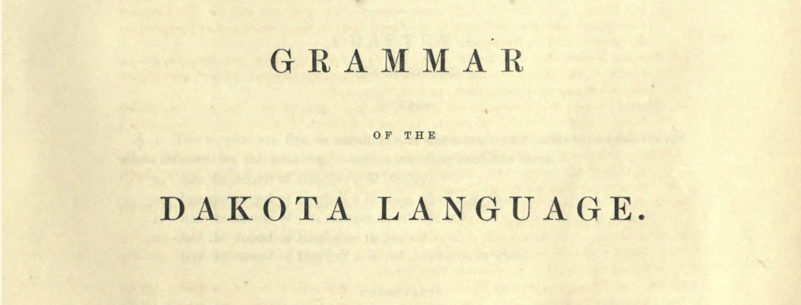
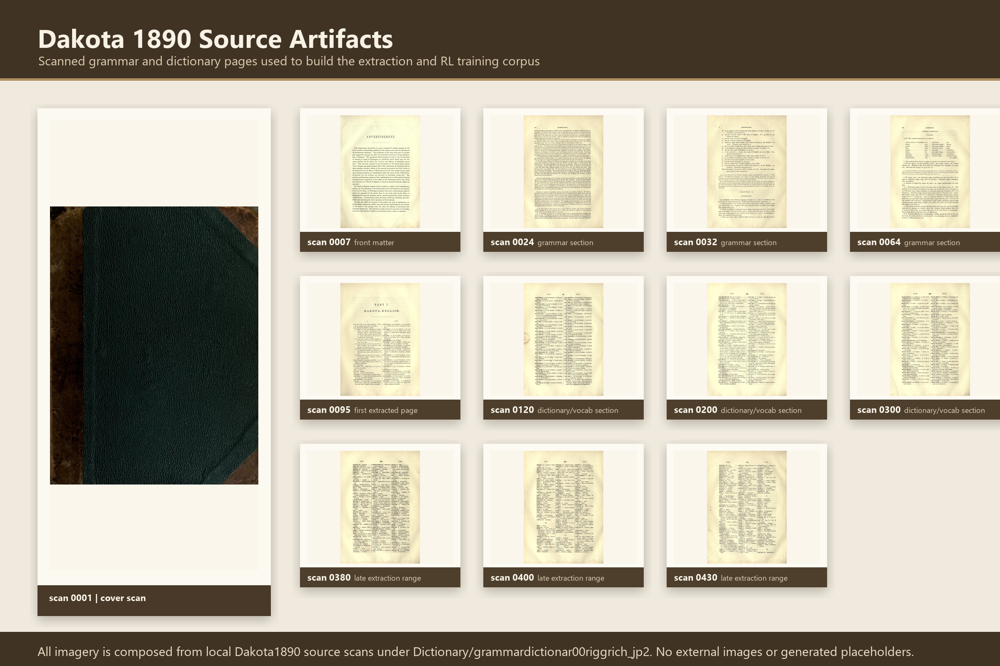
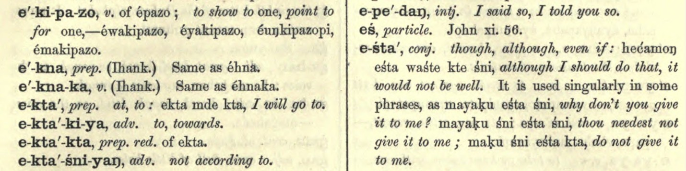
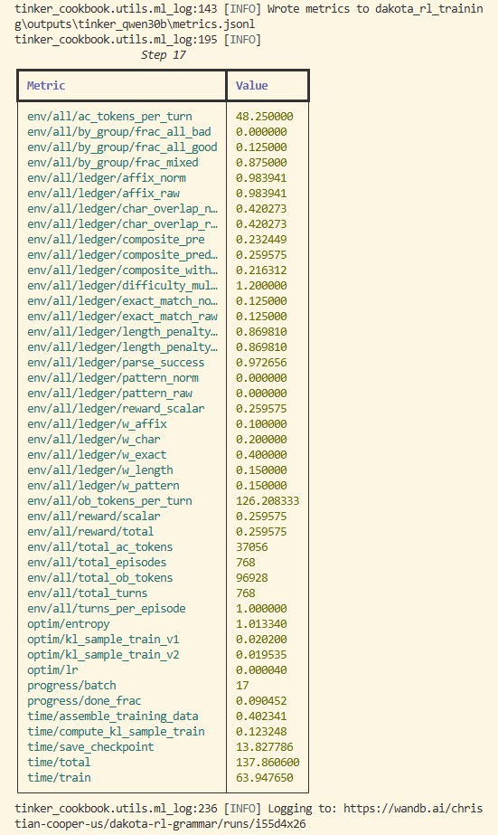

# Qwen3.6-35B-A3B-Dakota1890-GRPO

<p align="center">
  
</p>



This repository is being initialized for a new Dakota1890 reinforcement-learning run on Thinking Machines Tinker. The run is live, the repaired reward ledger is reporting, and the final LoRA adapter weights will be uploaded here after the Tinker checkpoint completes and passes the post-run audit.

The work starts from Stephen Return Riggs' 1890 Dakota grammar and dictionary materials: scanned pages, extracted grammar rules, dictionary vocabulary, and a verifier environment built to reward short, answer-only Dakota grammar behavior. The goal is not to create a general cultural authority or a fluent speaker replacement. The goal is narrower and more testable: preserve a historical grammar source as machine-readable tasks, train an open model adapter against explicit grammar rewards, and publish the artifacts in a way that makes the provenance and limitations visible.

The visual source collage is composed only from local Dakota1890 source scans. It spans cover/front matter, grammar pages, dictionary vocabulary pages, and the late extraction range through scan/page 430. The source manifest is included at [`assets/collage_manifest.md`](./assets/collage_manifest.md).

## Current Status

**Training is in progress.** This card is a staging model card for the active full run, not a completed checkpoint announcement.

- HF repo: `HarleyCooper/Qwen3.6-35B-A3B-Dakota1890-GRPO`
- Base model: `Qwen/Qwen3.6-35B-A3B`
- Training platform: Thinking Machines Tinker
- Method: GRPO-style RL with a custom Dakota grammar verifier
- Adapter type: LoRA, rank 32
- W&B project: [`christian-cooper-us/dakota-rl-grammar`](https://wandb.ai/christian-cooper-us/dakota-rl-grammar)
- Active full run: [`owf98569`](https://wandb.ai/christian-cooper-us/dakota-rl-grammar/runs/owf98569)
- Reward-channel pilot: [`d44bra91`](https://wandb.ai/christian-cooper-us/dakota-rl-grammar/runs/d44bra91)

The reward-channel pilot completed before the full run and cost about **$0.26**. It verified that the repaired environment can emit nonzero `pattern_raw` and `exact_match_raw` channels locally and in W&B before scaling up.

## Source Lineage

Dakota1890 is built around historical Dakota language source material rather than generic web text. The local project contains the primary Riggs scan, 440 scanned page images, public visual artifacts used for documentation, extracted grammar rules, extracted dictionary vocabulary, generated RL tasks, and W&B/Tinker run logs.

Source and extraction inventory:

- primary source PDF: `grammardictionar00riggrich.pdf`
- JP2 source scans: 440 local page images under `Dictionary/grammardictionar00riggrich_jp2`
- processed page images: 440 JPG conversions under `data/processed_images`
- page-layout manifest: 440 rows, including 345 two-column pages and 84 single-column pages
- grammar extraction: pages 1-92, with no missing pages in that intended range
- dictionary extraction: pages 95-430, with no missing pages in that intended range
- verified dictionary entries: 24,224
- median dictionary entries per extracted page: 63
- average extraction confidence: about 0.9245
- first and last verified headwords: `a` through `zig'zag`

The current RL grammar dataset contains:

- 10,576 total packaged RL tasks
- 1,497 extracted grammar-rule records
- 684 grammar rules in the grammar extraction pass
- 350 interlinear texts in the grammar extraction pass
- 396 linguistic terms in the grammar extraction pass
- 33 special-character forms observed in the grammar extraction pass
- 1,497 rows with pattern-bearing verification metadata
- 514 rows with affix metadata
- median reference answer length of about 4 words

Task family counts in the packaged dataset:

| Task family | Count |
|---|---:|
| `word_translation` | 2,879 |
| `reverse_translation` | 2,137 |
| `morphology` | 1,934 |
| `identify_pattern` | 1,497 |
| `positive_negative_evidence` | 584 |
| `exception_trigger` | 584 |
| `syntax` | 420 |
| `sentence_translation` | 316 |
| `affix_insertion` | 115 |
| `multi_step_morphology` | 110 |

The dictionary extraction and synthetic Q&A generation work are adjacent dataset-building tracks. This Tinker RL run does **not** require OpenAI SFT data or a synthetic dictionary Q&A dump to start; it trains against the existing grammar-task environment and its reward function. The dictionary artifacts remain important for future evaluation, documentation, and broader Dakota lexical coverage.

## Visual Project Artifacts

These local project images are included to preserve the visual record of the build alongside the model card:

| Artifact | Preview |
|---|---|
| Grammar source page |  |
| Dictionary source page |  |
| Training screenshot |  |

## What Changed For This Run

Earlier public runs showed `metrics/pattern_reward = 0.0` and `metrics/exact_match_reward = 0.0` throughout the public W&B surface. The pattern channel was a real plumbing bug: the packaged dataset stores metadata under `entry["info"]`, while the environment had been reading top-level fields such as `entry["verification_pattern"]`, `entry["task_type"]`, and `entry["difficulty"]`.

That has been fixed. The environment now preserves:

- task type
- difficulty
- rule id
- hints
- verification pattern, including `info.pattern`
- special-character and affix metadata

The full run now logs the composite reward ledger under namespaces such as `env/all/ledger/*`, `env/task/identify_pattern/ledger/*`, and difficulty-specific ledgers. Early full-run metrics already showed nonzero pattern reward on `identify_pattern` tasks with `composite_diff = 0.0`, meaning the logged scalar reward matches the reconstructed component ledger.

## Reward Function

The Dakota grammar verifier uses a composite reward:

| Component | Weight | Purpose |
|---|---:|---|
| exact match | 40% | Rewards short answers that exactly match rigid references |
| character overlap | 20% | Rewards lexical and orthographic overlap with the reference |
| pattern match | 15% | Rewards structural matches for rule-bearing tasks |
| affix accuracy | 10% | Rewards required Dakota affix behavior |
| length control | 15% | Penalizes verbose completions when the gold answer is short |

Difficulty multipliers are applied after the component sum. The run logs raw component values, normalized values, weights, weighted contributions, reconstructed composites, final reward scalar, and `composite_diff` for auditability.

Exact match is intentionally strict. In the older public 0.6B run, completions were often much longer than the reference answers, while the packaged dataset has a median reference answer length of about four words. That makes exact match a behavioral and prompting problem, not evidence that the exact-match function is dead. The new run keeps max generation short and logs enough ledger detail to diagnose whether exact-match-sensitive task families are improving.

## Training Configuration

The active full run was launched with:

| Setting | Value |
|---|---|
| model | `Qwen/Qwen3.6-35B-A3B` |
| batches planned | 199 |
| batch size | 48 |
| group size | 16 |
| max tokens | 128 |
| temperature | 0.5 |
| learning rate | `4e-5` |
| LoRA rank | 32 |
| eval interval | 20 batches |
| save interval | 20 batches |
| W&B sync | enabled |

The local runtime gate passed before launch with current Tinker, Tinker cookbook, W&B, Gemini, tokenizer, and reward-channel smoke checks.

## Intended Use

This adapter is intended for research and tool-building around historical Dakota grammar tasks:

- grammar-rule drills
- short translation and reverse-translation tasks
- morphology and affix experiments
- verifier-driven RL experiments for low-resource language work
- reproducible study of reward components for historical grammar sources

It is not intended as a standalone Dakota language authority, a substitute for community language expertise, or a production translation system.

## Limitations And Ethical Notes

The source material is a historical grammar and dictionary published in 1890. It reflects the terminology, analysis, orthography, and colonial-era framing of its time. Outputs from this model can inherit mistakes, omissions, and outdated descriptions from the source extraction process and from the base model.

Dakota language work should be reviewed with appropriate community and linguistic expertise. This repository should be treated as an experimental technical artifact: useful for transparent research, not authoritative for teaching, cultural interpretation, or official translation.

## Usage

Weights are pending. After the final adapter is uploaded, the expected usage pattern will be:

```python
from transformers import AutoModelForCausalLM, AutoTokenizer
from peft import PeftModel

base_model_name = "Qwen/Qwen3.6-35B-A3B"
adapter_name = "HarleyCooper/Qwen3.6-35B-A3B-Dakota1890-GRPO"

model = AutoModelForCausalLM.from_pretrained(
    base_model_name,
    device_map="auto",
    torch_dtype="auto",
    trust_remote_code=True,
)
tokenizer = AutoTokenizer.from_pretrained(base_model_name)
model = PeftModel.from_pretrained(model, adapter_name)

messages = [
    {"role": "system", "content": "Answer Dakota grammar tasks concisely. Return only the answer."},
    {"role": "user", "content": "Translate 'my elder brother' to Dakota. Return only the answer."},
]
text = tokenizer.apply_chat_template(messages, tokenize=False, add_generation_prompt=True)
inputs = tokenizer(text, return_tensors="pt").to(model.device)
outputs = model.generate(**inputs, max_new_tokens=64, do_sample=False)
print(tokenizer.decode(outputs[0], skip_special_tokens=True))
```

## Citation

Primary source:

> Riggs, Stephen Return. 1890. *A Dakota-English Dictionary*. Contributions to North American Ethnology, Volume VII. Washington: Government Printing Office.

Training and experiment tracking:

- Thinking Machines Tinker for the RL training run
- W&B for experiment tracking and reward-ledger audit trails
- Dakota1890 repository artifacts for extraction, task generation, and verifier code
